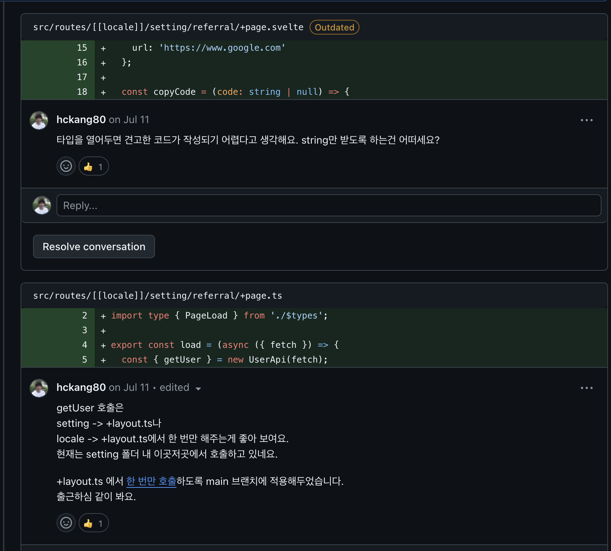

# 이력서 (RESUME)

  
코드 리뷰에 진심인 개발자 (클릭)

  
  
  
  
  
  

 

이름: 강희창

E-mail: hckang80@gmail.com

Linkedin: https://www.linkedin.com/in/heechang-kang-b3a7ba160

Techs:

Tools:

## 소개

*동료를 배려*하는 7년차 프론트엔드 개발자입니다.

2016년부터 프론트엔드 개발자로 두 곳의 스타트업을 거치며 여러 제품을 만들고 동료와 협업했습니다. 이전에는 여러 에이전시에서 8년 정도 *웹퍼블리셔로 근무한 경험*도 있습니다.

*예의와 존중을 최우선*으로 합니다. 이는 코드리뷰에서도 고스란히 들어납니다. 상대방의 기분을 언짢게 할 만한 언행을 절대하지 않으며 언성을 높이지 않습니다. 이를 통해 협업시 원활한 커뮤니케이션을 유지하며 마찰을 최소화할 수 있다고 생각합니다.

작성한 코드나 구현한 결과물 등을 *동료와 공유*하며 성취감을 느낍니다. 그리고 개발 트렌드, 컨퍼런스 정보, 소소한 팁 등을 공유하며 지식을 전파합니다. 단순히 링크만 공유하는 것이 아니라 짤막하게나마 느낌이나 생각을 덧붙여 공유합니다.

*요청은 항상 의도와 함께 전달*합니다. 이를 통해, 서로 간에 좀 더 정확한 피드백을 받을 수 있기 때문에 커뮤니케이션 비용이 절감되는 경험을 얻었습니다. 반대로, 요청을 받았을 때도 무조건 받아들이기보단 의도를 묻고 더 정확한 피드백을 주기 위해 노력합니다.

*시간을 효율적으로 활용*합니다. 디자인이나 서버 API를 전달받기 전까지 먼저 할수 있는 것들을 미리 구현하거나 관련자료를 찾아봅니다. 또한 기능 개발을 우선으로 진행하고 기술 부채나 고도화할 부분들을 메모해두어 잊지않고 개선해나갑니다. 바쁜 일정 속에서도 디 자인과 기능을 모두 신경 쓰기 위해 노력하며, UI/UX를 개선하는 데 적극적으로 참여합니다.

<!-- 

## 개발 경험

### 짧은 일정에도 불구하고 성과를 거둔 프로젝트

가장 최근 회사에서의 마지막 **3개월은 만보기 리워드 서비스를 개발**했습니다. 이 프로젝트는 짧은 기간에도 불구하고 [유의미한 성과](https://github.com/hckang80/RESUME?tab=readme-ov-file#bbzb-%EC%9B%B9%EB%B7%B0-%EA%B0%9C%EB%B0%9C)를 거둔 성공적인 사례였습니다.

각 팀원이 자신의 강점을 최대한 발휘할 수 있는 역할을 맡아 진행했고, 저는 **[디자인 시스템](https://uprise-fin.github.io/heybit-walk-svelte-ui)과 공통 인터페이스 개발**을 했습니다. 이를 통해, 동료 프론트엔드 개발자와 함께 일관성 있는 형태로 진행할 수 있었으며, 디자이너의 요구 사항에도 신속하게 대응할 수 있었습니다.

또한 동료 개발자가 병목을 겪을만한 지점을 미리 파악하고 직접 해결하거나 도움을 주어 효율적으로 시간을 활용했고, 에러의 원인 소재가 불분명할때도 먼저 해결책을 찾아냈습니다.

예를 들어, 다음과 같은 이슈가 있었습니다.

- **발생환경**: 플러터 웹뷰
- **증상**: 시스템 키보드에 의해 덮힌 부분은 스크롤 영역 안에 포함되지 않아서 화면이 잘림
- **해결방안**: resizeToAvoidBottomInset: true 옵션 주기

이러한 노력이 종합적으로 작용하여 빠른 시일 내에 서비스 런칭이 가능했습니다.

### 서비스 마이그레이션 리딩

서비스 코드 마이그레이션을 리딩하기 위해 부서를 이동하는 경험도 했습니다. 그런데 기존 서비스를 파악해보니 vscode의 코드 자동 완성, lint, prettier 등이 동작하지 않아 휴먼 에러를 일으키기 쉬운 열악한 환경이었습니다. 이 부분 개선을 해서 동료 개발자가 **안정적이고 편리하게 개발할 수 있도록 지원**을 하여 신임부터 얻었습니다. 그리고 웹뷰로 제공하는 서비스인데 UI 컴포넌트를 앱에서 제공하는 기술 부채가 있었습니다. 마이그레이션을 진행하면서 이를 웹 기반으로 이전하는 작업도 성공적으로 수행했습니다. 이를 통해 앱의 의존도를 줄이는 데 성공하여 **웹에서도 서비스 제공이 가능**하게 되었습니다. 이러한 것들을 토대로 서비스를 개선하여 좀 더 안정적인 마이그레이션이 가능했습니다.

### 웹 최적화와 생산성 - 두 마리 토끼 잡기

웹 최적화 과정 중 이미지 최적화는 굉장히 번거로운 작업입니다. 이를 해결하기 위해 [컴포넌트 제작 경험](https://velog.io/@_sky/%EC%9D%B4%EB%AF%B8%EC%A7%80-%EC%B5%9C%EC%A0%81%ED%99%94)이 있습니다. 이미지 작업 효율이 대폭 상승했습니다.

### 효율적인 시간 활용과 섬세함

디자인이나 서버 API를 전달 받기 전까지 먼저 할 수 있는 것들을 미리 구현하거나 관련 자료를 먼저 찾아봅니다. 또한 기능 개발 이후에 관련 기술 부채나 고도화할 부분들을 메모해두고 개선해나갑니다. 바쁜 일정 속에서도 디자인과 기능을 모두 신경 쓰기 위해 노력하며, UI/UX를 개선하는 데 적극적으로 참여합니다.

### 요청은 항상 의도와 함께 전달

이를 통해 좀 더 정확한 피드백을 받을 수 있기 때문에 커뮤니케이션 비용 절감이 가능한 경험을 얻었습니다. 반대로, 요청을 받았을 때도 무조건적으로 받아들이기보단 의도를 묻고 더 정확한 피드백을 주기 위해 노력합니다.

### 동료와 공유

작성한 코드나 구현한 결과물 등을 **동료와 공유**하며 성취감을 느낍니다. 그리고 개발 트렌드, 컨퍼런스 정보, 소소한 팁 등을 공유하며 지식을 전파합니다. 단순히 링크만 공유하는 것이 아니라 짤막하게나마 제 생각이나 느낌을 덧붙여 공유합니다.

### 디자인 시스템

웹 컴포넌트 기반의 디자인 시스템을 유지보수한 경험이 있습니다. 프론트엔드 프레임워크 종류에 상관없이 사용할 수 있는 웹 컴포넌트의 장점을 살리면서도 사용자 경험을 향상시키는 데 주력했습니다.

- **폼 요소 개선**: 웹 컴포넌트의 button 요소가 네이티브 동작과 다르다는 점을 발견하고, 웹킷 블로그 등 관련 자료를 참고하여 네이티브와 최대한 유사하게 동작하도록 개선하였습니다.
- **인풋 요소의 자동완성 지원**: 웹 컴포넌트의 인풋 요소에서 브라우저 자동완성 기능이 지원되지 않는 문제를 해결하려 노력했으며, 사용자 편의성을 높이기 위해 쉐도우 돔을 제거하거나 프레임워크에 종속된 형태로 개발하는 방식을 고려했습니다.
- **사용성 향상**: 직관적이고 편리한 컴포넌트 개발을 최우선으로 생각하며, 사용성과 개발 경험을 해치지 않도록 노력합니다.

컴포넌트 개발에서 가장 중요하다고 생각하는건 편리하고 직관적인 사용성입니다. 컴포넌트를 사용하면서 사용자의 경험 또는 개발 경험이 저해되어서는 안된다고 생각합니다. 적어도 기본 요소를 웹 컴포넌트로 제작했을때는 이러한 점을 충족하지 못하여 아쉬움이 남았습니다.

이러한 경험을 토대로 디자인 시스템을 여러 차례 제작했습니다.

- [BBZB 디자인 시스템 개발](https://github.com/uprise-fin/heybit-walk-svelte-ui)
- [든든 디자인 시스템 개발](https://github.com/uprise-fin/dndn-svelte-ui)

### HTML / CSS

- **웹표준 및 접근성 고려**: Semantic Markup을 지향하며 웹표준과 접근성을 고려한 개발을 선호합니다.
- **유지보수에 용이한 CSS 설계**: 중복을 최소화하고 가독성을 높이는 CSS를 설계하며, 미디어쿼리를 최소화하여 반응형 웹을 구현합니다.
- 스타일링하는 피로도를 줄이기 위한 최적화된 reset.css로 정의합니다.

### Javascript

- **ES6 이후 문법의 적극 활용**: 세련되고 가독성 좋은 코드를 작성하기 위해 ES6 이후의 문법을 선호합니다.
- **객체 리터럴을 활용한 조건문 대체**: else, else if, switch 등의 조건문을 지양하고, 객체 리터럴을 활용하여 가독성 있는 코드를 작성합니다.
- **함수형 프로그래밍 지향**: Array.prototype.forEach보다 map, reduce 등의 함수형 메서드를 활용하여 순수 함수를 작성하고 코드의 명료성을 높입니다. -->

## 경력사항

2022.06 ~ 2024.10

### [업라이즈](https://www.uprise.financial)

로보어드바이저 서비스 스타트업 / 프론트엔드 개발자
 
신규 서비스 개발, 웹뷰 운영, 서비스 마이그레이션, _디자인시스템_ 구축 등을 진행하면서 작은 규모 프론트엔드 팀의 *실질적인 리더 역할*도 겸했습니다. heybit 서비스 운영이 주요 업무였지만 부서 이동도 경험하면서 비트버니, 든든 등 *대부분의 사내 서비스를 경험*했습니다.
서비스 운영과 구축 과정에서 *공통 설계를 주로 담당*했습니다.
  

2018.06 ~ 2022.06

### [SentBe](https://company.sentbe.com)

해외 송금 서비스 스타트업 / 프론트엔드 개발자
 
개발자 신입으로 입사하여 4년간 근무했습니다.
어드민 등 다수의 *백오피스를 마땅한 기획과 디자인 없이 처음부터 구축*하는 진귀한 경험을 했습니다. 퍼블리셔로 오래 근무한 경험이 있었기에 프로젝트를 성공적으로 수행할 수 있었습니다. 해외 송금 서비스와 더불어 이직할때까지 계속 운영했습니다.
*타입스크립트를 도입하고 전파*하여 휴먼 에러 방지와 개발 생산성 향상에도 기여했습니다.

## 프로젝트

_3개월 만에 DAU 3K 달성한_

### 쭈쭈좐삐(BBZB) - 대만향 만보기 리워드 서비스 웹뷰

- 주요 작업
  - 액션바, 네비게이션 등 공통 UI 컴포넌트를 개발하여 관리가 용이하도록 구성
  - toast, dialog를 편리하게 호출할 수 있도록 store 기반의 공통 인터페이스 개발하여 업무 효율 증가
  - 서버의 실제 응답과 지정한 타입의 일치 여부를 서버 요청시 즉시 판별하도록 구성하여 타입 오류가 확산되는 것을 초기 방지
  - 스토리북으로 디자인시스템 개발([코드](https://github.com/uprise-fin/heybit-walk-svelte-ui))([데모](https://uprise-fin.github.io/heybit-walk-svelte-ui))하여 일관성을 유지하며 업무 효율 증가
  - 웹뷰 환경에서의 트러블 슈팅
- 주요 기술

  - SvelteKit, typescript, zod, Storybook

   

_앱 의존성을 축소하여 웹에서도 동작하도록 개선한_

### 든든 - 증권 로보어드바이저 서비스 웹뷰

- 주요 작업
  - Nuxt.js(vue)로 제작된 기존 서비스 운영 및 SvelteKit 기반으로 마이그레이션
  - 공통 UI 컴포넌트를 개발하여 앱 의존성 축소
  - SNS 로그인 서비스를 구축하여 유저 편의 향상
  - 스토리북으로 디자인시스템 개발
  - 서버 요청하는 hook을 적절하게 변경 -> 렌더링 속도 향상, Cumulative Layout Shift(CLS) 등의 웹 성능 최적화
  - ESLint, Prettier가 동작하도록 vscode 기반의 개발 환경 개선
- 주요 기술

  - Nuxt.js(vue), SvelteKit, typescript, zod, Storybook

   

_마이그레이션의 시작_

### Heybit - web3 로보어드바이저 서비스

- 주요 작업
  - Nuxt.js(vue)로 제작된 기존 서비스 운영 및 SvelteKit 기반으로 마이그레이션
  - [이미지 컴포넌트](https://velog.io/@_sky/%EC%9D%B4%EB%AF%B8%EC%A7%80-%EC%B5%9C%EC%A0%81%ED%99%94)를 제작하여 웹 성능 및 개발 생산성 향상
  - js로 작성된 스타일 관련 로직을 css로 리팩토링
  - css 초기화 방식을 개선하여 스타일링의 괴로움 해소
- 주요 기술
  - Nuxt.js(vue), SvelteKit, typescript, zod

 

_typescript를 도입한_

### Sentbe - 해외 송금 서비스

- 주요 작업
  - 하나로 고정된 송금 국가(한국)를 확장 가능한 형태로 미리 개선. 이후에 싱가폴, 인도네시아 등을 성공적으로 런칭할 수 있는 기반으로 작용함.
  - 서버 응답을 사용하여 수취 국가별 폼이 그려지도록 개선하여 국가 추가가 용이해짐
  - 다국어 파일 로드를 지연시켜서 First Contentful Paint(FCP) 향상
  - Options API를 Composition API로 마이그레이션하면서 typescript를 도입
  - Firebase 기반에서 SNS 로그인 구현
  - 메인 페이지 UI 전면 리뉴얼
- 주요 기술
  - Nuxt.js(vue), Element UI

 

### Admin Dashboard - Sentbe 서비스의 관리자 페이지

- 주요 작업
  - 고객의 송금 정보 수정, 게시판 관리 등
- 주요 기술
  - Vue.js, Element UI

 

### Data Center - Sentbe 서비스의 데이터 시각화 대시보드

- 주요 작업
  - UI 레이아웃 설계
  - Chart.js를 이용하여 UI 구현
- 주요 기술
  - Vue.js, Element UI, Chart.js

 

_입사 후 첫 미션_

### SentBe Rates - 20개국 이상의 수취 국가별 환율 모니터링 서비스

- 주요 작업
  - Todo List 구현 수준의 단일 페이지 프로젝트
- 주요 기술
  - Vue.js

  
퍼블리셔 경력사항 (끊임없이 7년 9개월)

- 2015.07 ~ 2017.09

  ## **와플러스** (마케팅 에이전시, 직전 회사에서 인수합병) / UX 개발팀 / 퍼블리셔

  ### **웹사이트 제작 및 운영**

  - Done
    - 웹접근성 마크 획득 및 갱신
    - PHP 기반 웹사이트의 프론트엔드 범위 수정
    - 반응형 및 모바일 웹사이트 제작
    - 웹사이트 퍼블리싱 관련 사내 가이드 제작 (마크업, 스타일 컨벤션)

   

- 2012.12 ~ 2015.06

  ## **와플즈** (웹 에이전시) / UX 개발팀 / 퍼블리셔

  ### **웹사이트 제작 및 운영**

  - Done
    - 자사 사이트 리뉴얼, 반응형 및 모바일 웹사이트 제작
    - 다양한 솔루션(Cafe24, 메이크샵, 그누보드)을 이용한 쇼핑몰 구축

   

- 2012.01 ~ 2012.11

  ## **프리랜서** / 퍼블리셔

  ### **SKTworld 홈페이지 리뉴얼**

  - Experience
    - SVN 형상관리 시스템 사용
    - 다수(8명) 작업자간의 협업 경험

   

  ### **교보전자도서관 웹사이트 구축**

  - Experience
    - 소규모(2명) 협업 경험

   

  ### **네이트 호핀 서비스 운영**

   

- 2011.07 ~ 2011.12

  ## **TWD** (웹 에이전시, 직전 회사에서 인수합병) / Creative / 퍼블리셔

  ### **웹사이트 제작 및 운영**

  - Done
    - 삼성, KT 등 대기업 서비스 페이지 구축(웹퍼블리싱 및 UI개발 단독)
    - 성신여대 홈페이지 구축

   

- 2010.01 ~ 2011.06

  ## **아이코닉 인터랙티브** (웹 에이전시) / Creative / 퍼블리셔

  ### **이벤트 프로모션 페이지 제작 및 운영**

  - Done - 넷마블 게임 이벤트 프로모션 페이지 제작
   
  

## ETC.

- 2012 ~ 2022

  [하드코딩하는사람들(네이버 카페) 스탭](https://cafe.naver.com/hacosa)

- 2013 ~ 2015

  [웹표준 파헤치기(개인 세미나) 진행](https://onoffmix.com/event/44035)

## Education

- 2018.01 ~ 2018.04

  패스트캠퍼스 - 프론트엔드 개발 스쿨

  html, css, javascript, angular 과정을 수료했습니다.

- 2009.07 ~ 2009.12

  한국직업전문학교 - 웹미디어 디자인

  html, css를 다루는 웹표준 과정과 디자인 교육을 수료했습니다.

## Contact

