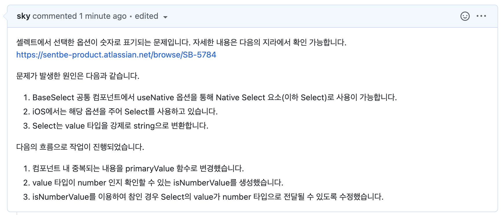
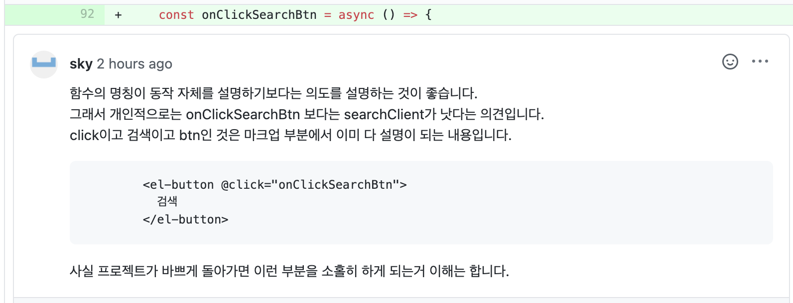
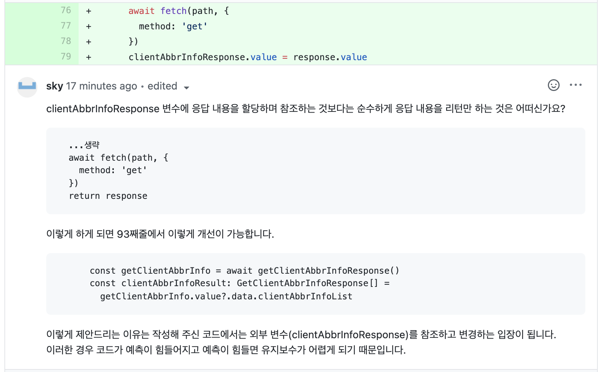
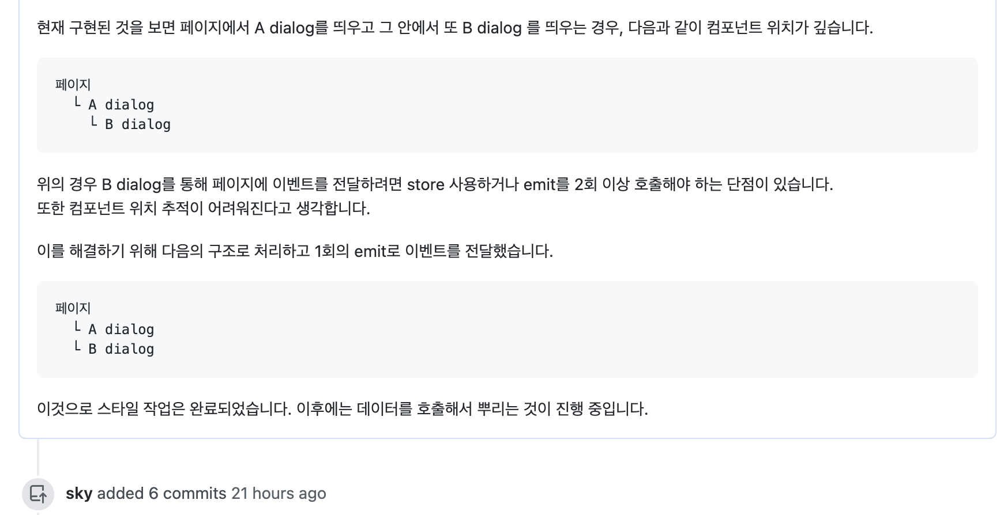

# 이력서 (RESUME)

  
코드 리뷰에 진심인 개발자 (클릭)

  
  
  
  
  

 

이름: 강희창

E-mail: hckang80@gmail.com

Github: https://github.com/hckang80

Linkedin: https://www.linkedin.com/in/hee-chang-kang-b3a7ba160

Techs:

Tools:

<mark>Jira</mark>,
<mark>Notion</mark>,
<mark>Bitburkit</mark>,
<mark>Github</mark>,
<mark>Figma</mark>

## 소개
**저는 이러한 개발자입니다.**
- 타인의 기분이 언짢은만한 언행은 절대하지 않으며 항상 예의를 지키고 존중합니다. 이는 상호간 마찰이 없게 하고 커뮤니케이션도 원활하게 합니다.
- 코드 리뷰에 적극적이고 빠르게 참여합니다. 또한 Task 크기를 잘 조절하여 리뷰어에게 부담을 주지 않으려 노력합니다.
- Best practice, [클린코드](https://github.com/qkraudghgh/clean-code-javascript-ko#clean-code-javascript)를 지향하며 근본적인 해결을 위해 항상 고민합니다. 작성한 코드에 찜찜함이 남았다면 관련 자료를 찾아보며 더 나은 코드로 작성하는 결과를 가져옵니다.
- 마치 레고와 같은 작은 단위의 함수로 작성하려 노력합니다. 이는 재사용이 가능하고 읽기 쉬우므로 생산성이 증가한다고 생각합니다.

**지그재그 앱 일부를 웹으로 구현해 봤습니다. 코드 스타일을 확인할 수 있습니다.**
- [Nuxt3.js(Vue)를 활용한 클론 코딩](https://github.com/hckang80/nuxt3-clone-zigzag#지그재그-앱-클론-코딩)

## 스킬

### HTML / CSS
- 웹표준과 접근성을 고려한 Semantic Markup을 선호합니다.
- 유지보수가 용이하고 중복 없는 css를 설계합니다.
- 미디어쿼리를 최소화하는 최적화된 반응형 웹으로 구현합니다.

### Javascript
- ES6 이전의 문법보다는 이후의 문법을 선호합니다. 좀 더 세련된 가독성 좋은 코드 작성이 가능하다고 생각하기 때문입니다.
- else, else if, switch 등의 조건문을 지양하며 Object literal로 표현합니다.
- Array.prototype.forEach 보다는 순수 함수로 작성할 수 있는 map, reduce 등을 선호합니다.
- 실행 컨텍스트, 호이스팅 등의 근본 지식을 이해하며 설명할 수 있습니다.

### Vue.js
- Vuex의 Mutations를 남용하지 않습니다. 이러한 측면에서 [Pinia](https://pinia.vuejs.org/)를 좋아합니다.
- 동적 컴포넌트를 활용할 수 있고 Stateless한 컴포넌트로 제작하여 재사용합니다.
- [Options API](https://v3.vuejs-korea.org/api/options-api.html), [Composition API](https://v3.vuejs-korea.org/api/composition-api.html) 모두 능숙합니다.

## 경력사항
- 2022.06 ~

  ## **Uprise** (핀테크 스타트업) / 헤이비트 / 프론트엔드 개발자
  https://www.uprise.financial/
  https://www.heybit.io/

   

- 2018.06 ~ 2022.06

  ## **SentBe** (핀테크 스타트업) / Product Group / 프론트엔드 개발자
  https://company.sentbe.com/

  ### **SentBe 서비스 신규 개발 및 운영**

  - Description
    - B2C 해외송금 서비스

  - Done
    - 미국 송금 런칭
    - Composition API + Typescript 도입
    - 환불 시스템 자동화
    - Firebase 기반 소셜로그인 구현
    - Global 서비스 런칭
    - 서비스 메인 랜딩 페이지 전면 개편

  - Tech stack
    - Nuxt.js(Vue), Sass, Element UI

   

  ### **Admin Dashboard**

  - Description
    - B2C 해외송금 서비스의 관리자 대시보드

  - Done
    - 기본적인 UX와 API만 제공 받고 최초 설계부터 대부분의 기능 구현

  - Tech stack
    - Vue.js, Sass, Element UI

   

  ### **혜택 탭**

  - Description
    - 웹뷰로 제공하는 앱내 단일 메뉴

  - Done
    - 내 쿠폰함, 쿠폰 목록, 내 등급, 친구 초대 등의 화면 제작

  - Tech stack
    - Vue.js, Sass, Bootstrap Vue

   

  ### **Fx Rates**

  - Description
    - 환율 관제 대시보드

  - Done
    - API만 제공 받고 최초 설계부터 모든 기능 구현
    - 최초 배포 이후, 드물게 추가 메뉴의 CRUD 구현

  - Tech stack
    - Vue.js, Sass, Element UI

   

  ### **Data Center**

  - Description
    - B2C 해외송금 서비스의 송금 추이 및 고객 분포 등을 알 수 있는 데이터 시각화 대시보드

  - Done
    - 기본적인 UX와 API만 제공 받고 최초 설계부터 모든 기능 구현

  - Tech stack
    - Vue.js, Sass, Element UI, Chart.js

   

  ### **SentBe Rates**

  - Description
    - 국가별 환율 모니터링이 가능한 단일 페이지 서비스

  - Done
    - 최초 설계부터 모든 기능 구현

  - Tech stack
    - Vue.js, Sass

  
퍼블리셔 경력사항 (끊임없이 7년 9개월)

- 2015.07 ~ 2017.09

  ## **와플러스** (마케팅 에이전시, 직전 회사에서 인수합병) / UX 개발팀 / 퍼블리셔

  ### **웹사이트 제작 및 운영**

  - Done
    - 웹접근성 마크 획득 및 갱신
    - PHP 기반 웹사이트의 프론트엔드 범위 수정
    - 반응형 및 모바일 웹사이트 제작
    - 웹사이트 퍼블리싱 관련 사내 가이드 제작 (마크업, 스타일 컨벤션)

   

- 2012.12 ~ 2015.06

  ## **와플즈** (웹 에이전시) / UX 개발팀 / 퍼블리셔

  ### **웹사이트 제작 및 운영**

  - Done
    - 자사 사이트 리뉴얼, 반응형 및 모바일 웹사이트 제작
    - 다양한 솔루션(Cafe24, 메이크샵, 그누보드)을 이용한 쇼핑몰 구축

   

- 2012.01 ~ 2012.11

  ## **프리랜서** / 퍼블리셔

  ### **SKTworld 홈페이지 리뉴얼**

  - Experience
    - SVN 형상관리 시스템 사용
    - 다수(8명) 작업자간의 협업 경험

   

  ### **교보전자도서관 웹사이트 구축**

  - Experience
    - 소규모(2명) 협업 경험

   

  ### **네이트 호핀 서비스 운영**

   

- 2011.07 ~ 2011.12

  ## **TWD** (웹 에이전시, 직전 회사에서 인수합병) / Creative / 퍼블리셔

  ### **웹사이트 제작 및 운영**

  - Done
    - 삼성, KT 등 대기업 서비스 페이지 구축(웹퍼블리싱 및 UI개발 단독)
    - 성신여대 홈페이지 구축

   

- 2010.01 ~ 2011.06

  ## **아이코닉 인터랙티브** (웹 에이전시) / Creative / 퍼블리셔

  ### **이벤트 프로모션 페이지 제작 및 운영**

  - Done
    - 넷마블 게임 이벤트 프로모션 페이지 제작
   

## 기타 활동
- 2012 ~

  [하드코딩하는사람들(네이버 카페) 스탭](https://cafe.naver.com/hacosa)

- 2013 ~ 2015

  [웹표준 파헤치기(개인 세미나) 진행](https://onoffmix.com/event/44035)

## 교육 이수
- 2018.01 ~ 2018.04

  패스트캠퍼스(프론트엔드개발스쿨 8기)

  Front-End 과정 수료

- 2009.07 ~ 2009.12

  한국직업전문학교(웹미디어 디자인 38기)

  웹퍼블리셔, 디자인 과정 수료

## Contact

