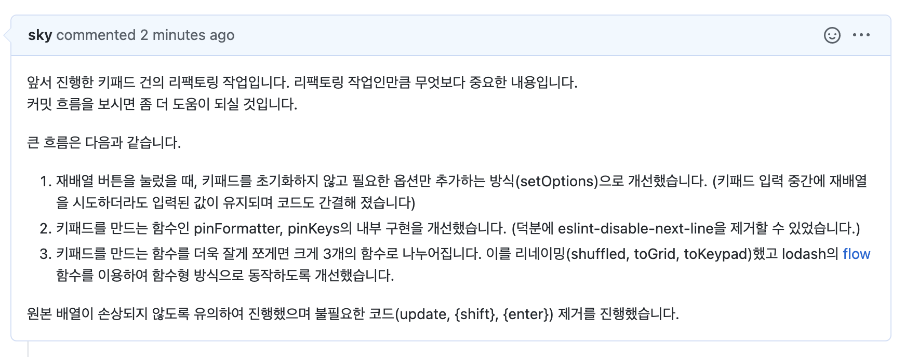

# 이력서 (RESUME)

  
코드 리뷰에 진심인 개발자 (클릭)

  
  
  
  
  

 

이름: 강희창

E-mail: hckang80@gmail.com

Github: https://github.com/hckang80

Linkedin: https://www.linkedin.com/in/heechang-kang-b3a7ba160

Techs:

Tools:

<mark>Jira</mark>,
<mark>Notion</mark>,
<mark>Bitburkit</mark>,
<mark>Github</mark>,
<mark>Figma</mark>

## 소개

**저는 이러한 개발자입니다.**

- 🧑‍🤝‍🧑 타인의 기분이 언짢은만한 언행은 절대하지 않으며 항상 예의를 지키고 존중합니다. 이는 상호간 마찰이 없게 하고 커뮤니케이션도 원활하게 합니다.
- 📝 코드 리뷰에 적극적이고 빠르게 참여합니다. 또한 Task 크기를 잘 조절하여 리뷰어에게 부담을 주지 않으려 노력합니다.
- 🤔 Best practice, [클린코드](https://github.com/qkraudghgh/clean-code-javascript-ko#clean-code-javascript)를 지향하며 근본적인 해결을 위해 항상 고민합니다. 작성한 코드에 찜찜함이 남았다면 관련 자료를 찾아보며 더 나은 코드로 작성하는 결과를 가져옵니다.
- 🧩 레고와 같은 작은 단위의 함수로 작성하려 노력합니다. 이는 재사용이 가능하고 읽기 쉬우므로 생산성이 증가한다고 생각합니다.

<!-- **지그재그 앱 일부를 웹으로 구현해 봤습니다. 코딩 스타일을 확인할 수 있습니다.**

- [Nuxt3.js(Vue)를 활용한 클론 코딩](https://github.com/hckang80/nuxt3-clone-zigzag#지그재그-앱-클론-코딩) -->

## 개발 경험

신규 기능을 개발할 때, 일정을 준수할 수 있는 수준으로 제안하고 개발합니다.
이후에 고도화하는 것을 놓치기 쉬운데 이것을 메모해놓고 놓치지 않으려고 노력합니다.
일정이 빠듯한 경우, 기능이 최우선이 되므로 디자인에 소홀할 수도 있지만 그렇지 않기 위해 애씁니다.

공유하는 것을 좋아합니다.
내가 작성한 코드, 개발한 화면 등을 공유하며 뿌듯함과 성취감을 느낍니다.
또한 개발 트랜드나 컨퍼런스 정보 또는 소소한 팁 등을 공유합니다.

nuxt.js 및 sveltekit으로 제작된 서비스를 구축 및 운영한 경험이 있습니다.
sveltekit로 개발하는 것을 좋아합니다.

웹뷰로 제공하던 서비스에서 모달 등의 UI 컴포넌트는 앱 기반에서 제공이 되고 있었습니다. 이러한 서비스에서 UI 컴포넌트를 웹에서 제공하도록 이전하는 경험도 했습니다.

### 웹 컴포넌트

[웹 컴포넌트](https://developer.mozilla.org/ko/docs/Web/API/Web_components) 기반 디자인 시스템을 유지보수한 경험이 있습니다.
이는 프론트엔드 프레임워크 종류와 상관없이 사용할 수 있는 장점이 있지만 버튼, 인풋 등 기본 요소를 웹 컴포넌트로 제작했을때는 사용성에 불편함을 느꼈습니다.

첫째로, form submitting의 어려움이었습니다.
네이티브 button 요소는 form 내외 위치 여부에 따라 submit 또는 button 타입으로 동작합니다. 또한, 타입이 button 임을 명시하면 form 안에서도 버튼 역할로 동작합니다.
하지만, 웹 컴포넌트 button의 동작은 달랐습니다. 이를 개선하기 위해 [웹킷 블로그](https://webkit.org/blog/13711/elementinternals-and-form-associated-custom-elements/)를 참고하여 네이티브 사용성과 최대한 닮도록 구현했습니다. 컴포넌트를 이용하는 동료 개발자가 불편함을 겪지 않도록 기틀을 마련한 것입니다.

둘째로, 인풋 요소가 브라우저 자동 완성 기능을 지원하지 못했습니다.
사용자가 이러한 편리함을 얻지 못한다면 사용하기 어려운 컴포넌트라고 생각합니다.
적어도 쉐도우 돔을 걷어내거나 프레임 워크에 종속된 형태로 개발해야 겠다고 마음먹은 계기가 되었습니다.

컴포넌트 개발에서 가장 중요하다고 생각하는건 편리하고 직관적인 사용성입니다. 컴포넌트를 사용하면서 사용자의 경험 또는 개발 경험이 저해되어서는 안된다고 생각합니다. 적어도 기본 요소를 웹 컴포넌트로 제작했을때는 이러한 점을 충족하지 못하여 아쉬움이 남았습니다.

### HTML / CSS

- 웹표준과 접근성을 고려한 Semantic Markup을 선호합니다.
- 유지보수가 용이하고 중복 없는 css를 설계합니다.
- 미디어쿼리를 최소화하는 최적화된 반응형 웹으로 구현합니다.
- 개발자의 피로도를 줄이기 위해 불편함 없는 reset.css로 정의합니다.

### Javascript

- ES6 이후의 깔끔한 문법을 선호합니다. 좀 더 세련되고 가독성 좋은 코드 작성이 가능하다고 생각하기 때문입니다.
- else, else if, switch 등의 조건문을 지양하며 Object literal로 표현하여 가독성 있는 코드로 작성합니다.
- Array.prototype.forEach 보다는 순수 함수로 작성할 수 있는 map, reduce 등을 선호합니다.

## 경력사항

- 2022.06 ~

  ## **Uprise** (핀테크 스타트업) / 프론트엔드 개발자

  https://www.uprise.financial/

  ### <a href="https://github.com/uprise-fin/heybit-walk-svelte-ui">BBZB 디자인 시스템 개발</a>

  ### BBZB 웹앱 서비스 개발
  
  ### 든든 웹앱 리뉴얼

  - 초기 빌딩 작업부터 참여 (nuxt.js -> sveltekit)

  ### <a href="https://github.com/uprise-fin/dndn-svelte-ui">든든 디자인 시스템 개발</a>

  - sveltekit + storybook

  ### Heybit 주요 서비스 개발

  ### Heybit DeFi

  - Description

    - 복잡하고 어려운 디파이(Decentralized Finance) 투자를 간편하게 해주는 서비스

  - Done

    - 베타서비스 출시(2022.06 ~ 2022.09.14) 및 운영

  

- 2018.06 ~ 2022.06

  ## **SentBe** (핀테크 스타트업) / Product Group / 프론트엔드 개발자

  https://company.sentbe.com/

  ### **SentBe 서비스 신규 개발 및 운영**

  - Description

    - B2C 해외송금 서비스

  - Done

    - 미국 송금 런칭
    - Composition API + Typescript 도입
    - 환불 시스템 자동화
    - Firebase 기반 소셜로그인 구현
    - Global 서비스 런칭
    - 서비스 메인 랜딩 페이지 전면 개편

  - Tech stack
    - Nuxt.js(Vue), Sass, Element UI

   

  ### **Admin Dashboard**

  - Description

    - B2C 해외송금 서비스의 관리자 대시보드

  - Done

    - 기본적인 UX와 API만 제공 받고 최초 설계부터 대부분의 기능 구현

  - Tech stack
    - Vue.js, Sass, Element UI

   

  ### **혜택 탭**

  - Description

    - 웹뷰로 제공하는 앱내 단일 메뉴

  - Done

    - 내 쿠폰함, 쿠폰 목록, 내 등급, 친구 초대 등의 화면 제작

  - Tech stack
    - Vue.js, Sass, Bootstrap Vue

   

  ### **Fx Rates**

  - Description

    - 환율 관제 대시보드

  - Done

    - API만 제공 받고 최초 설계부터 모든 기능 구현
    - 최초 배포 이후, 드물게 추가 메뉴의 CRUD 구현

  - Tech stack
    - Vue.js, Sass, Element UI

   

  ### **Data Center**

  - Description

    - B2C 해외송금 서비스의 송금 추이 및 고객 분포 등을 알 수 있는 데이터 시각화 대시보드

  - Done

    - 기본적인 UX와 API만 제공 받고 최초 설계부터 모든 기능 구현

  - Tech stack
    - Vue.js, Sass, Element UI, Chart.js

   

  ### **SentBe Rates**

  - Description

    - 국가별 환율 모니터링이 가능한 단일 페이지 서비스

  - Done

    - 최초 설계부터 모든 기능 구현

  - Tech stack
    - Vue.js, Sass

  
퍼블리셔 경력사항 (끊임없이 7년 9개월)

- 2015.07 ~ 2017.09

  ## **와플러스** (마케팅 에이전시, 직전 회사에서 인수합병) / UX 개발팀 / 퍼블리셔

  ### **웹사이트 제작 및 운영**

  - Done
    - 웹접근성 마크 획득 및 갱신
    - PHP 기반 웹사이트의 프론트엔드 범위 수정
    - 반응형 및 모바일 웹사이트 제작
    - 웹사이트 퍼블리싱 관련 사내 가이드 제작 (마크업, 스타일 컨벤션)

   

- 2012.12 ~ 2015.06

  ## **와플즈** (웹 에이전시) / UX 개발팀 / 퍼블리셔

  ### **웹사이트 제작 및 운영**

  - Done
    - 자사 사이트 리뉴얼, 반응형 및 모바일 웹사이트 제작
    - 다양한 솔루션(Cafe24, 메이크샵, 그누보드)을 이용한 쇼핑몰 구축

   

- 2012.01 ~ 2012.11

  ## **프리랜서** / 퍼블리셔

  ### **SKTworld 홈페이지 리뉴얼**

  - Experience
    - SVN 형상관리 시스템 사용
    - 다수(8명) 작업자간의 협업 경험

   

  ### **교보전자도서관 웹사이트 구축**

  - Experience
    - 소규모(2명) 협업 경험

   

  ### **네이트 호핀 서비스 운영**

   

- 2011.07 ~ 2011.12

  ## **TWD** (웹 에이전시, 직전 회사에서 인수합병) / Creative / 퍼블리셔

  ### **웹사이트 제작 및 운영**

  - Done
    - 삼성, KT 등 대기업 서비스 페이지 구축(웹퍼블리싱 및 UI개발 단독)
    - 성신여대 홈페이지 구축

   

- 2010.01 ~ 2011.06

  ## **아이코닉 인터랙티브** (웹 에이전시) / Creative / 퍼블리셔

  ### **이벤트 프로모션 페이지 제작 및 운영**

  - Done - 넷마블 게임 이벤트 프로모션 페이지 제작
   
  

## 기타 활동

- 2012 ~ 2022

  [하드코딩하는사람들(네이버 카페) 스탭](https://cafe.naver.com/hacosa)

- 2013 ~ 2015

  [웹표준 파헤치기(개인 세미나) 진행](https://onoffmix.com/event/44035)

## 교육 이수

- 2018.01 ~ 2018.04

  패스트캠퍼스(프론트엔드개발스쿨 8기)

  Front-End 과정 수료

- 2009.07 ~ 2009.12

  한국직업전문학교(웹미디어 디자인 38기)

  웹퍼블리셔, 디자인 과정 수료

## Contact

